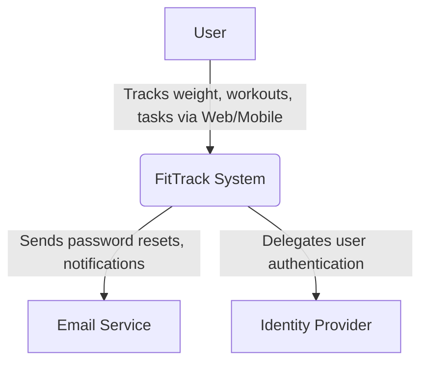
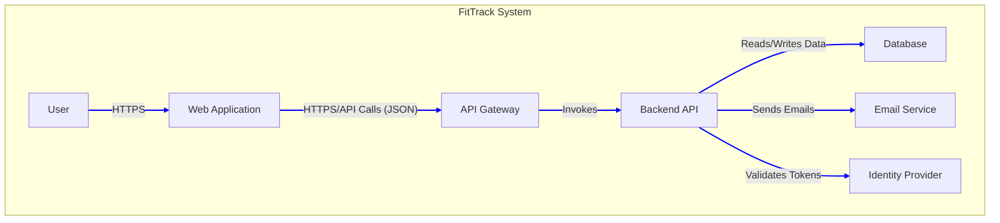

# BUSINESS POSTURE

The proposed system is a consumer-facing application, "FitTrack", designed to help users track personal health and productivity metrics, including weight, workouts, and tasks. The primary business goal is to capture a segment of the crowded health and wellness market by offering a unified, user-friendly experience that combines fitness and productivity tracking.

Business priorities are centered around a Minimum Viable Product (MVP) strategy. The key objectives are:
1.  Rapid Time-to-Market: To quickly validate the product idea and gather user feedback.
2.  Excellent User Experience (UX): To create a simple, intuitive, and responsive interface that works seamlessly on both mobile and web browsers, which will be a key differentiator.
3.  Scalability: To build an architecture that can cost-effectively handle user growth if the application proves successful.
4.  User Trust: To establish and maintain user trust by demonstrating a commitment to data privacy and security from day one.

The most significant business risks are:
1.  Market Adoption Risk: Failure to attract and retain users in a competitive market due to a lack of differentiating features or poor user experience.
2.  Data Breach Risk: The system will store sensitive Personal Identifiable Information (PII) and Personal Health Information (PHI). A security breach would result in severe reputational damage, loss of user trust, and potential regulatory fines, effectively ending the business.
3.  Operational Cost Risk: Choosing an architecture that is expensive to operate at low user levels could make the business model unsustainable before it achieves profitability.

# SECURITY POSTURE

This is a greenfield project with no pre-existing security controls. The security posture must be built from the ground up, balancing the need for speed (MVP) with the critical requirement to protect sensitive user data.

- `security control`: The system will be developed following a Secure Software Development Lifecycle (SSDLC).
- `security control`: All infrastructure will be provisioned using Infrastructure as Code (IaC) to ensure repeatable, auditable, and secure environments.
- `security control`: A CI/CD pipeline will be used for all deployments, incorporating automated security scanning (SAST, dependency scanning).
- `accepted risk`: For the initial MVP launch, the system will not pursue formal compliance certifications like HIPAA or SOC 2. However, the architecture will be designed with compliance in mind to facilitate future certification. This is accepted to expedite time-to-market.
- `accepted risk`: Advanced threat detection capabilities (e.g., a dedicated SIEM or WAF with complex rule sets) will not be implemented for the initial launch. The system will rely on the default logging, monitoring, and security features provided by the cloud provider.

Recommended High-Priority Security Controls:
- `security control`: Utilize a managed third-party Identity Provider (e.g., AWS Cognito, Auth0) to handle all aspects of user authentication, including registration, login, and password management.
- `security control`: Enforce HTTPS/TLS for all data in transit between the client, API, and other services.
- `security control`: Encrypt all sensitive user data at rest within the database.
- `security control`: Implement robust input validation and output encoding on the API to prevent common injection attacks (e.g., XSS, SQLi).
- `security control`: Implement a Content Security Policy (CSP) to mitigate cross-site scripting attacks.
- `security control`: Employ the principle of least privilege for all IAM roles and access policies within the cloud environment.

Security Requirements:
1.  All user-provided data must be considered sensitive and protected accordingly.
2.  User data must be encrypted both in transit and at rest.
3.  Users must be authenticated to access or modify any data within the system.
4.  A user must only be authorized to view and manipulate their own data. Cross-user data access is strictly forbidden.
5.  All system dependencies (libraries, packages) must be regularly scanned for known vulnerabilities.
6.  The system must be protected against the OWASP Top 10 web application security risks.
7.  Sensitive credentials, such as API keys and database passwords, must not be hardcoded in the application code and must be managed via a secure secret management service.

# DESIGN

## C4 CONTEXT

This diagram shows the FitTrack system, its users, and the external systems it interacts with.



| Name | Type | Description | Responsibilities | Security controls |
| :--- | :--- | :--- | :--- | :--- |
| User | Person | An individual who uses the FitTrack app to manage their health and productivity. | Enters and views their weight, workout, and task data. Manages their account settings. | Uses a secure password. Protects their own device. |
| FitTrack System | Software System | The application being designed. It provides the core functionality for data tracking and visualization. | Provides UI for data entry and dashboarding. Stores and manages user data securely. Handles all business logic. | Implements all application-level security controls, including authorization, input validation, and data protection. |
| Email Service | Software System | An external, third-party service for sending transactional emails. (e.g., AWS SES, SendGrid). | Delivers emails for account verification, password resets, and other notifications. | Secures API keys for sending emails. Uses TLS for communication. |
| Identity Provider | Software System | An external, third-party service that manages user identity and authentication. (e.g., AWS Cognito, Auth0). | Handles user sign-up, sign-in, multi-factor authentication (MFA), and password management. Issues secure tokens (JWT). | Provides secure user directory, password hashing, and brute-force protection. |

## C4 CONTAINER

This diagram shows the high-level containers (applications, data stores) that make up the FitTrack System.



| Name | Type | Description | Responsibilities | Security controls |
| :--- | :--- | :--- | :--- | :--- |
| Web Application | Container: Single-Page App | A responsive JavaScript application (e.g., React, Vue) that runs in the user's web browser or as a Progressive Web App (PWA) on mobile. | Renders the user interface. Provides all user-facing functionality. Makes API calls to the Backend API. | Implements Content Security Policy (CSP). Securely handles authentication tokens (e.g., in memory). Performs client-side validation. |
| API Gateway | Container: API Gateway | A managed service (e.g., AWS API Gateway) that acts as the single entry point for all API requests from the Web Application. | Routes requests to the correct Backend API endpoint. Handles request throttling and rate limiting. Performs initial authentication/authorization checks. | Enforces TLS. Validates JWTs from the Identity Provider. Can be integrated with a Web Application Firewall (WAF). |
| Backend API | Container: Serverless Functions | A set of functions (e.g., AWS Lambda) that implement the core business logic of the application. | Manages user data (CRUD operations for weight, workouts, tasks). Contains all business rules. Integrates with the database and other services. | Implements business-level authorization (ensuring users only access their own data). Performs robust server-side input validation. Handles secrets securely. |
| Database | Container: Relational Database | A managed relational database (e.g., PostgreSQL on AWS RDS) that stores all user data. | Persists user profiles, weight entries, workout logs, and task lists. Ensures data integrity through schemas and constraints. | Encrypts all data at rest. Network access is restricted to the Backend API only (e.g., via security groups). Enforces TLS for connections. Regular backups. |

## C4 DEPLOYMENT

This diagram illustrates how the containers are deployed onto the infrastructure in a cloud environment (AWS).

```mermaid
graph TD
    subgraph "User's Device"
        A[Web Browser]
    end

    subgraph "AWS Cloud (us-east-1)"
        B[CloudFront CDN] -- "Serves static content" --> C[S3 Bucket]
        A -- "HTTPS" --> B
        A -- "API Calls" --> D[API Gateway]
        D -- "Triggers" --> E[Lambda Functions]
        E -- "VPC Peering/Endpoint" --> F[RDS PostgreSQL]
        E -- "IAM Role" --> G[Identity Provider (Cognito)]
        E -- "IAM Role" --> H[Email Service (SES)]

        subgraph "VPC"
            E
            F
        end
    end

    style C fill:#f9f,stroke:#333,stroke-width:2px
    style F fill:#f9f,stroke:#333,stroke-width:2px
```

| Name | Type | Description | Responsibilities | Security controls |
| :--- | :--- | :--- | :--- | :--- |
| Web Browser | Deployment Node | The web browser running on the user's computer or mobile device. | Executes the Single-Page Application (Web Application container). | Subject to the browser's security model (sandboxing, same-origin policy). |
| CloudFront CDN | Deployment Node | AWS's Content Delivery Network. | Distributes the static assets (HTML, CSS, JS) of the Web Application globally for low-latency access. | Enforces HTTPS via AWS Certificate Manager (ACM). Can be configured with AWS WAF for edge protection. |
| S3 Bucket | Deployment Node | AWS's object storage service. | Stores the compiled static files for the Web Application. | Configured for static website hosting. Access is restricted to CloudFront only using an Origin Access Identity (OAI). |
| API Gateway | Deployment Node | The managed AWS API Gateway service. | Provides a stable, secure endpoint for the Backend API. | Deployed within the AWS managed environment. Configured to authorize requests using JWTs from Cognito. |
| Lambda Functions | Deployment Node | The AWS Lambda serverless compute environment. | Executes the Backend API code in response to API Gateway triggers. | Runs within a Virtual Private Cloud (VPC) for network isolation. Executes with a specific IAM role with least-privilege permissions to access other AWS services. |
| RDS PostgreSQL | Deployment Node | The managed AWS Relational Database Service running a PostgreSQL instance. | Hosts the application's database. | Deployed in a private subnet within the VPC, inaccessible from the public internet. Access is controlled by security groups, allowing connections only from the Lambda functions. Encryption at rest is enabled. |
| Identity Provider (Cognito) | Deployment Node | The managed AWS Cognito service. | Manages the user pool and identity services. | This is a managed service, with security handled by AWS. We configure user pool policies (e.g., password strength). |
| Email Service (SES) | Deployment Node | The managed AWS Simple Email Service. | Sends emails on behalf of the application. | This is a managed service. Access is controlled via a least-privilege IAM role. |

# RISK ASSESSMENT

What are critical business process we are trying to protect?
- User Authentication: The process of securely signing up and logging in users. If compromised, all user data is at risk.
- Personal Data Management: The core functionality of the application - creating, reading, updating, and deleting weight, workout, and task data. The integrity, confidentiality, and availability of this data are paramount to the business's success and user trust.
- Account Management: Processes like password reset and email updates are critical. If compromised, they can lead to account takeover.

What data we are trying to protect and what is their sensitivity?
- User Account Data: Includes email address, name, and hashed password. This is considered PII and has a HIGH sensitivity.
- Weight and Workout Data: This data can be considered Personal Health Information (PHI). It reveals long-term health trends and physical activity patterns. It has a HIGH sensitivity.
- Task List Data: This can contain a wide range of personal or professional information entered by the user. Its sensitivity is MEDIUM to HIGH, depending on the content.
- Authentication Tokens (JWTs): Short-lived credentials used to maintain user sessions. Compromise of a token leads to session hijacking. Sensitivity is HIGH.

# QUESTIONS & ASSUMPTIONS

Questions:
- What is the anticipated user load for the first six months? This will influence database sizing and API Gateway throttling configurations.
- Are there plans for social features, such as sharing workouts or competing with friends? This would introduce significant complexity to the authorization model.
- What is the budget for third-party services? This will inform the choice between different tiers of services like the Identity Provider.
- Will the application require push notifications to mobile devices in the future? This would require integrating with services like Apple Push Notification Service (APNS) and Firebase Cloud Messaging (FCM).
- Are there any specific data residency requirements (e.g., must data for European users be stored in the EU)?

Assumptions:
- It is assumed that the initial target audience is global, and a single-region deployment (e.g., us-east-1) is acceptable for the MVP.
- It is assumed that the development team has expertise in the chosen technology stack (React, Node.js, AWS serverless services).
- It is assumed that for the MVP, a single relational database schema will be sufficient and a microservices architecture is not yet needed.
- It is assumed that the business is comfortable relying on a single cloud provider (AWS) for all infrastructure needs.
- It is assumed that basic logging and monitoring provided by AWS (CloudWatch) will be sufficient for the initial launch.
