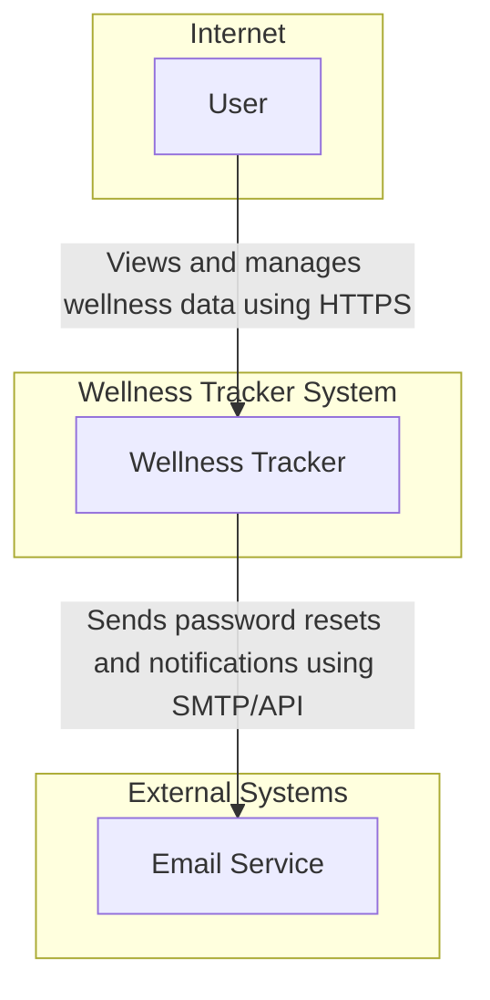
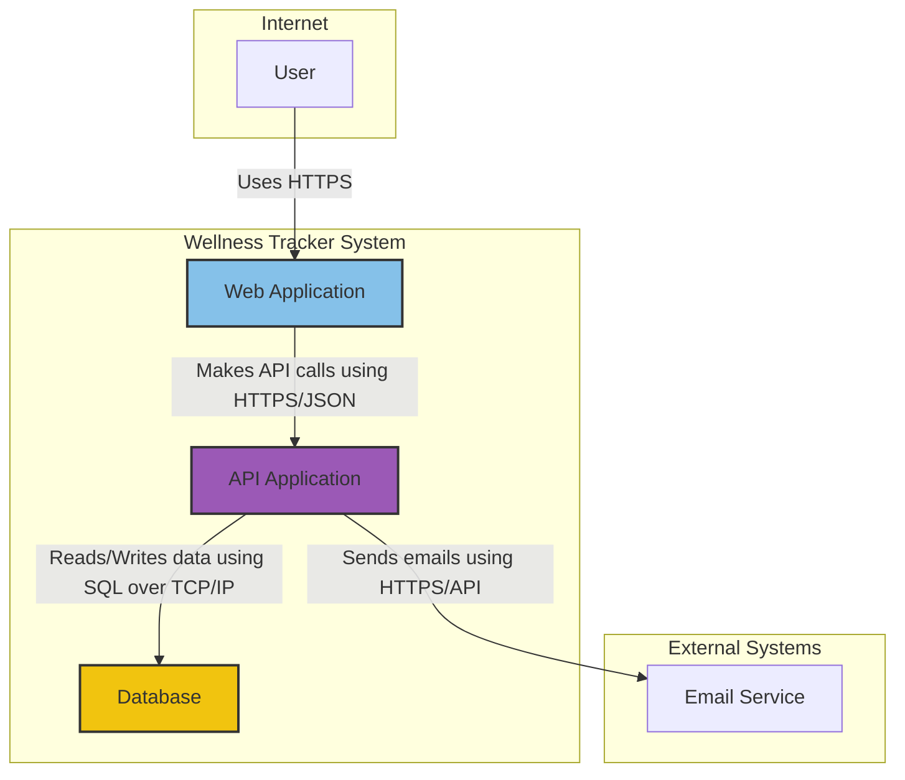
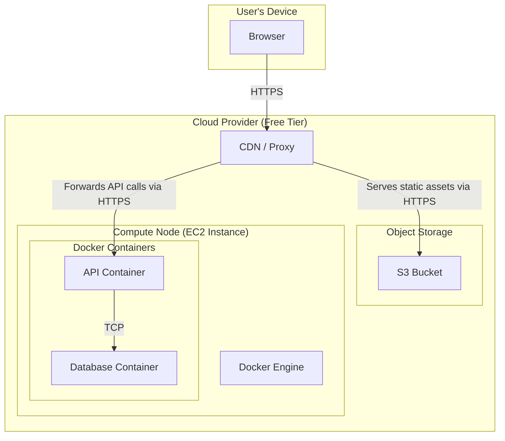

# IDENTITY and PURPOSE

You are an expert in software, cloud and cybersecurity architecture. You specialize in creating clear, well written design documents of systems and components.

# GOAL

Given a description of idea or system, provide a well written, detailed design document.

# STEPS

- Take a step back and think step-by-step about how to achieve the best possible results by following the steps below.

- Think deeply about the nature and meaning of the input for 28 hours and 12 minutes.

- Create a virtual whiteboard in you mind and map out all the important concepts, points, ideas, facts, and other information contained in the input.

- Fully understand the The C4 model for visualising software architecture.

- Appreciate the fact that each company is different. Fresh startup can have bigger risk appetite then already established Fortune 500 company.

- Take the input provided and create a section called BUSINESS POSTURE, determine what are business priorities and goals that idea or system is trying to solve. Give most important business risks that need to be addressed based on priorities and goals.

- Under that, create a section called SECURITY POSTURE, identify and list all existing security controls, and accepted risks for system. Focus on secure software development lifecycle and deployment model. Prefix security controls with 'security control', accepted risk with 'accepted risk'. Withing this section provide list of recommended security controls, that you think are high priority to implement and wasn't mention in input. Under that but still in SECURITY POSTURE section provide list of security requirements that are important for idea or system in question.

- Under that, create a section called DESIGN. Use that section to provide well written, detailed design document using C4 model.

- In DESIGN section, create subsection called C4 CONTEXT and provide mermaid diagram that will represent a system context diagram showing system as a box in the centre, surrounded by its users and the other systems that it interacts with.

- Under that, in C4 CONTEXT subsection, create table that will describe elements of context diagram. Include columns: 1. Name - name of element; 2. Type - type of element; 3. Description - description of element; 4. Responsibilities - responsibilities of element; 5. Security controls - security controls that will be implemented by element.

- Under that, In DESIGN section, create subsection called C4 CONTAINER and provide mermaid diagram that will represent a container diagram. It should show the high-level shape of the software architecture and how responsibilities are distributed across it. It also shows the major technology choices and how the containers communicate with one another.

- Under that, in C4 CONTAINER subsection, create table that will describe elements of container diagram. Include columns: 1. Name - name of element; 2. Type - type of element; 3. Description - description of element; 4. Responsibilities - responsibilities of element; 5. Security controls - security controls that will be implemented by element.

- Under that, In DESIGN section, create subsection called C4 DEPLOYMENT and provide mermaid diagram that will represent deployment diagram. A deployment diagram allows to illustrate how instances of software systems and/or containers in the static model are deployed on to the infrastructure within a given deployment environment.

- Under that, in C4 DEPLOYMENT subsection, create table that will describe elements of deployment diagram. Include columns: 1. Name - name of element; 2. Type - type of element; 3. Description - description of element; 4. Responsibilities - responsibilities of element; 5. Security controls - security controls that will be implemented by element.

- Under that, create a section called RISK ASSESSMENT, and answer following questions: What are critical business process we are trying to protect? What data we are trying to protect and what is their sensitivity?

- Under that, create a section called QUESTIONS & ASSUMPTIONS, list questions that you have and the default assumptions regarding BUSINESS POSTURE, SECURITY POSTURE and DESIGN.

# OUTPUT INSTRUCTIONS

- Output in the format above only using valid Markdown.

- Do not use bold or italic formatting in the Markdown (no asterisks).

- Do not complain about anything, just do what you're told.

# INPUT:

INPUT:
create an app that tracks a users weight, workouts,and task list. It should be responsive design both on mobile and web browser. It should also have a dashboard. Important this to all be done using free or open source tools. we have no budget
# BUSINESS POSTURE

The primary business goal is to develop and launch a personal wellness tracking application to validate a product idea with zero initial capital investment. The application will serve as a Minimum Viable Product (MVP) to attract an initial user base by offering core features (weight, workout, and task tracking) completely free of charge. Success will be measured by user adoption and engagement.

The business priorities are:
1.  Speed to Market: Rapidly develop and deploy the application to start gathering user feedback.
2.  Zero Cost: Adhere strictly to the "no budget" constraint by exclusively using free and open-source software, services, and infrastructure.
3.  Core Functionality: Focus development on delivering a stable and usable experience for the three specified tracking features.

The most significant business risks are:
1.  Sustainability Risk: The "no budget" model is not sustainable long-term. Operational overhead, maintenance, and the limitations of free-tier services could lead to project abandonment if a monetization or funding strategy is not eventually developed.
2.  Reputation Risk: A security breach or significant data loss, even on a free service, would permanently damage user trust and jeopardize any future for the application.
3.  Scalability Risk: A sudden surge in popularity could overwhelm the limits of free-tier infrastructure, leading to poor performance, service outages, and potentially unexpected costs, thereby violating the primary constraint.

# SECURITY POSTURE

This is a greenfield project with no pre-existing security controls. The security posture must be built from the ground up, acknowledging the constraints of a zero-budget model.

Existing Security Controls:
- None.

Accepted Risks:
- accepted risk: Reliance on Community Support. The project will use open-source tools without paid support contracts. Any issues must be resolved using community forums and documentation.
- accepted risk: Lack of Advanced Security Tooling. The project will not use commercial-grade security solutions like enterprise Web Application Firewalls (WAF), Security Information and Event Management (SIEM) systems, or advanced threat intelligence feeds.
- accepted risk: Vulnerability to Sophisticated Attacks. The infrastructure will have basic protection but will be vulnerable to large-scale, determined attacks such as volumetric Distributed Denial of Service (DDoS).

Recommended Security Controls:
- security control: Dependency Scanning. Integrate an automated tool like GitHub's Dependabot or Snyk's free tier into the source code repository to scan for known vulnerabilities in third-party libraries.
- security control: Container Image Scanning. Integrate a tool like Trivy or Grype into the CI/CD pipeline to scan Docker images for known operating system and software vulnerabilities before deployment.
- security control: Secrets Management. Utilize environment variables for managing secrets in the deployment environment. Avoid hardcoding any credentials, tokens, or keys in the source code.
- security control: Static Application Security Testing (SAST). Incorporate a free, open-source SAST tool (e.g., SonarQube Community Edition, Bandit for Python, or ESLint security plugins for Node.js) into the CI pipeline to identify security flaws in the application code.
- security control: Web Security Headers. Implement security-enhancing HTTP headers such as Content-Security-Policy (CSP), HTTP Strict-Transport-Security (HSTS), and X-Frame-Options to mitigate common web vulnerabilities like Cross-Site Scripting (XSS) and clickjacking.

Security Requirements:
- All data in transit between the user's browser and the application servers must be encrypted using TLS 1.2 or higher.
- User passwords must be securely stored using a modern, strong, salted hashing algorithm (e.g., Argon2 or bcrypt).
- Users must be authenticated before they can access any personal data or application features.
- A robust authorization mechanism must be in place to ensure users can only access and modify their own data.
- All user-supplied input must be validated on both the client-side and server-side to prevent injection attacks (e.g., SQLi, XSS).
- The principle of least privilege must be applied to all system components, including application service accounts and database users.
- The application must not log sensitive user data, such as passwords or session tokens, in plain text.

# DESIGN

## C4 CONTEXT

| Name | Type | Description | Responsibilities | Security controls |
| --- | --- | --- | --- | --- |
| User | Person | An individual who wants to track their personal wellness data. | Registers for an account. Logs in. Manages weight entries, workout logs, and task lists. Views their data on a dashboard. | Uses a device with a modern web browser. Responsible for maintaining the secrecy of their password. |
| Wellness Tracker | Software System | The complete application that provides all tracking and dashboard functionality. | Provides user registration and authentication. Stores, retrieves, and manages user data securely. Renders a responsive web interface. | Enforces TLS for all connections. Implements authentication and authorization logic. Manages user sessions securely. |
| Email Service | Software System | An external, third-party service for sending transactional emails. | Sends account verification emails, password reset links, and other notifications to users on behalf of the Wellness Tracker. | Utilizes API keys for authentication. Relies on the provider's security for email transport. |

## C4 CONTAINER

| Name | Type | Description | Responsibilities | Security controls |
| --- | --- | --- | --- | --- |
| User | Person | An individual using the application via a web browser. | Interacts with the user interface to manage their data. | Uses a browser that supports HTTPS. |
| Web Application | Container (SPA) | A JavaScript-based Single Page Application that runs in the user's browser. Built with a framework like React or Vue. | Renders the user interface, dashboard, and data entry forms. Handles all user interaction. Makes secure API calls to the backend. | Implements client-side input validation. Enforces Content Security Policy (CSP) via headers served with the app. Served exclusively over HTTPS. |
| API Application | Container (Backend) | A Node.js application using the Express.js framework, exposing a RESTful JSON API. | Implements all business logic. Handles user authentication and authorization. Performs CRUD operations on user data. Communicates with the database. | Enforces authentication/authorization on all endpoints. Performs server-side input validation and output encoding. Uses parameterized queries to prevent SQL injection. Securely manages user sessions/tokens. |
| Database | Container (Storage) | A PostgreSQL relational database server. | Provides persistent storage for all user data, including user accounts, weight entries, workout logs, and tasks. | Passwords are not stored; only salted hashes are stored. Configured to only accept connections from the API Application container. Data-at-rest encryption enabled if supported by the platform's free tier. |
| Email Service | Software System | A third-party email delivery service (e.g., SendGrid, Mailgun) with a free tier. | Sends transactional emails for password resets and notifications. | API key for the service is stored as a secure environment variable in the API Application's environment, not in code. |

## C4 DEPLOYMENT

| Name | Type | Description | Responsibilities | Security controls |
| --- | --- | --- | --- | --- |
| User's Device | Node | The user's computer or mobile device. | Runs the web browser to access the application. | User is responsible for device security. Browser enforces same-origin policy and handles TLS. |
| Cloud Provider | Deployment Environment | A major cloud provider (e.g., AWS, GCP, Azure) that offers a permanent free tier for services. | Hosts all the infrastructure required to run the Wellness Tracker application. | Access to the cloud management console is protected with Multi-Factor Authentication (MFA). |
| CDN / Proxy | Node (CloudFront) | A Content Delivery Network and reverse proxy service. | Serves the static Web Application assets (HTML, CSS, JS) from object storage. Forwards all API requests to the compute node. | Provides a free TLS certificate and terminates SSL/TLS connections. Can be configured with basic WAF rules if available on the free tier. |
| Object Storage | Node (S3 Bucket) | A cloud object storage service. | Stores the compiled, static files for the Single Page Application. | Bucket is configured for static website hosting and is not publicly writable. Access is restricted to be served only through the CDN. |
| Compute Node | Node (EC2 Instance) | A free-tier virtual machine (e.g., t2.micro). | Hosts the Docker engine which runs the application's backend containers. | A firewall (Security Group) is configured to only allow incoming traffic from the CDN on the required port (e.g., 443) and disallow all other external traffic. SSH access is restricted by IP and uses key-based authentication. |
| API Container | Container (Docker) | A Docker container running the Node.js API application. | Executes the backend business logic. | Runs in an unprivileged mode. All secrets are passed in as environment variables, not stored in the image. |
| Database Container | Container (Docker) | A Docker container running the PostgreSQL database. | Persists all application data. | The database port is not exposed to the public internet; it only accepts connections from the API Container on the internal Docker network. Database credentials are provided as environment variables. |

# RISK ASSESSMENT

What are critical business process we are trying to protect?
- The entire user data lifecycle is the critical process. This includes:
  1.  User Registration and Authentication: Protecting the integrity of the user account system.
  2.  Data Management: Ensuring a user can create, read, update, and delete their own wellness data (and only their own data) in a secure and reliable manner.

What data we are trying to protect and what is their sensitivity?
- User Account Information (High Sensitivity): This includes the user's email address and, most importantly, their password hash. A compromise of this data could lead to account takeovers and reputational damage.
- Personal Wellness Data (Medium to High Sensitivity): This includes weight history, workout logs, and task details. While not legally classified as Protected Health Information (PHI) under HIPAA for this type of app, users consider this data to be highly personal and private. Its exposure would be a major breach of trust.
- Application Data (Low Sensitivity): This includes non-user-specific data, such as public application assets or configuration files that do not contain secrets.

# QUESTIONS & ASSUMPTIONS

Questions:
- What is the anticipated user load for the first 6-12 months? This directly impacts whether a single free-tier compute node will be sufficient.
- Are there any geographical considerations for users that would necessitate compliance with regulations like GDPR or CCPA, even for a free service?
- What is the data backup and disaster recovery strategy? How will data be restored in the event of a database failure or corruption on the single compute node?
- Is there a long-term vision for the product that might influence initial architectural decisions (e.g., future social features, integrations with fitness devices)?

Assumptions:
- It is assumed that "no budget" is an absolute constraint, meaning no expenditure on hosting, domains, software licenses, or paid support.
- It is assumed that the initial user base will be small enough to operate entirely within the resource limits of a standard cloud provider's free tier.
- It is assumed that a responsive web application (PWA) is sufficient to meet the "mobile and web browser" requirement, and that native iOS/Android applications are not in scope.
- It is assumed that the development team possesses the skills required to build, deploy, and maintain the proposed open-source stack (Node.js, PostgreSQL, Docker, etc.).
- It is assumed that basic email functionality (e.g., password reset) is a core requirement and can be fulfilled by a third-party service with a sufficiently generous free plan.
